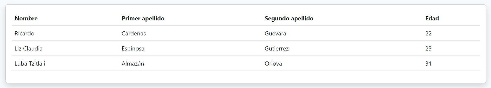

# Simple Template Renderer

Renderizador de templates sencillo para HTML.

---

## Uso

Para poder renderizar un template, es necesario registrarlo mediante el atributo `template` colocando como valor el nombre con el que será registrado.

```html
<table class="table">
  <thead>
    <tr>
      <th>Nombre</th>
      <th>Primer apellido</th>
      <th>Segundo apellido</th>
      <th>Edad</th>
    </tr>
  </thead>
  <tbody>
    <tr template="person">
      <td>${name}</td>
      <td>${surname}</td>
      <td>${lastname}</td>
      <td>${age}</td>
    </tr>
  </tbody>
</table>
```

### Mostrar propiedades de un objeto

Para mostrar un objeto utilizando un template, se debe invocar a la función `render()`, en la cual hay que mandar el nombre del template, junto a un objeto cuyas propiedades correspondan a las variables que desean mostrarse en el template.

```javascript
const person = {
  name: "Ricardo",
  surname: "Cárdenas",
  lastname: "Guevara",
  age: "22",
};

render("person", person);
```

El código anterior generará el siguiente resultado:


### Mostrar arreglos

Para mostrar un arreglo, este puede ser mandado a la función `render()` de la misma forma que cualquier otro objeto. Al renderizar un arreglo, se llenará y pintará un template para cada elemento del arreglo.

```javascript
const people = [
  {
    name: "Ricardo",
    surname: "Cárdenas",
    lastname: "Guevara",
    age: "22",
  },
  {
    name: "Liz Claudia",
    surname: "Espinosa",
    lastname: "Gutierrez",
    age: "23",
  },
  {
    name: "Luba Tzitlali",
    surname: "Almazán",
    lastname: "Orlova",
    age: "31",
  },
];

render("person", people);
```



### Mostrar número de fila

Es posible mostrar el número de fila al mostrar una lista mediante la variable auxiliar `#{count}`.

```html
<table class="table">
  <thead>
    <tr>
      <th>#</th>
      <th>Nombre</th>
      <th>Primer apellido</th>
      <th>Segundo apellido</th>
      <th>Edad</th>
    </tr>
  </thead>
  <tbody>
    <tr template="person">
      <td>#{count}</td>
      <td>${name}</td>
      <td>${surname}</td>
      <td>${lastname}</td>
      <td>${age}</td>
    </tr>
  </tbody>
</table>
```

---

## Referencia

### Atributos

| Atributo   | Valor               |
| ---------- | ------------------- |
| `template` | Nombre del template |

### Tipos de variable

|   Tipo    |   Sintaxis    |                               Uso                               |
| :-------: | :-----------: | :-------------------------------------------------------------: |
| Propiedad | `${variable}` | Mostrar propiedades del objeto mandado en la función `render()` |
| Auxiliar  | `#{variable}` |       Mostrar propiedades especiales al mostrar arreglos        |

### Variables axuliares

| Variable | Valor renderizado                                             |
| -------- | ------------------------------------------------------------- |
| index    | Posición dentro del arreglo del objeto mostrado (inicia en 0) |
| count    | Conteo de elementos mostrados (inicia en 1)                   |
